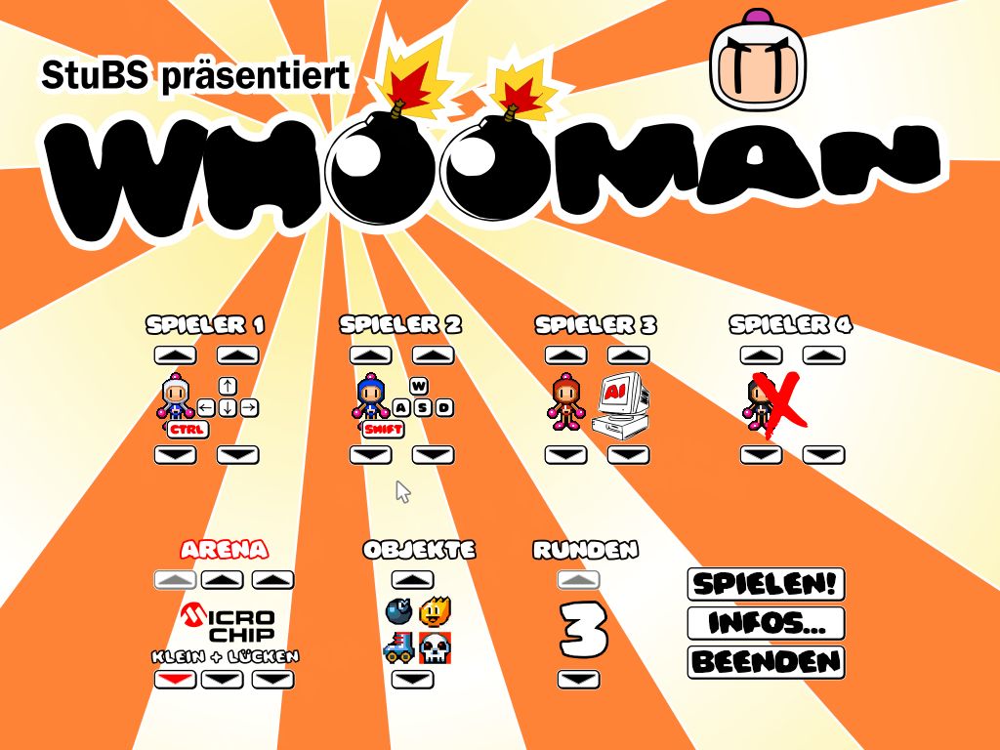
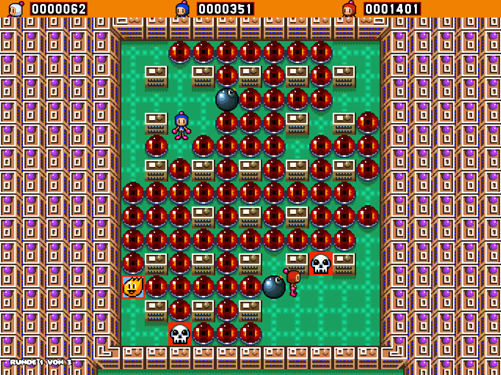
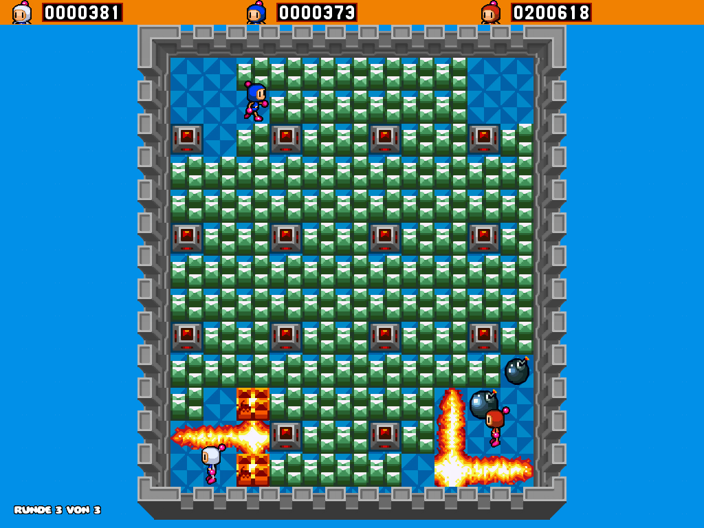

WHOOMan - ein Bomberman-Klon in (OO)StuBS
=========================================

Dieses Spiel, basierend auf dem aktuellen (Stand Januar 2021) 64-bit StuBS, soll
die Möglichkeiten von etwas komplexeren Anwendungen für die freiwillige 
[Aufgabe 7](https://www4.cs.fau.de/Lehre/WS20/V_BS/Uebungen/aufgabe7/a7.shtml)
im Fach Betriebssystem demonstrieren.

Es werden dabei die neue (schnellere) Grafikbibliothek mit der Möglichkeit 
Bilder im PNG Format vom Dateisystem zu laden ausgiebig genutzt, neben der
Mausunterstützung (aus den optionalen Aufgaben).

Dabei sind die Modifikationen am StuBS Kern minimal, für das Spiel selbst
mussten keine weiteren Hardwaretreiber implementiert werden -- lediglich die
Spielmechanik mit ihrer grafischen Ausgabe.

Dabei wurde (mangels Talent) auf vorhande Bilddateien (zum Teil aus SNES Roms)
zurückgegriffen und für das Spiel [angepasst](https://de.wikipedia.org/wiki/Hqx).

Zur einfacheren Entwicklung wurden die Ein- und Ausgabeschnittstellen mittels
[SDL](https://de.wikipedia.org/wiki/Simple_DirectMedia_Layer) nachgeahmt und
zuerst unter einem aktuellen Linux entwickelt, bevor mti den Anpassungen von
StuBS begonnen wurde.

Benutzung
---------

Um sowohl die bootfähige ISO (`bomber.iso`) als auch die SDL-Anwendung
(`bomber-sdl`) zu erstellen, einfach

    make

ausführen. Dabei wird natürlich die Entwicklungsumgebung für StuBS inklusive
GRUB und Xorriso vorausgesetzt, sowie die SDL Bibliothek.

Das erstellte Abbild kann auch direkt in Qemu (mit Hardwarebeschleunigung)
gestartet werden:

    make kvm

Autor
-----

Stückchenweise programmiert (mit langenen Pausen) zwischen Anfang 2018 und 2021
von [Bernhard Heinloth](mailto:bernhard@heinloth.net).
